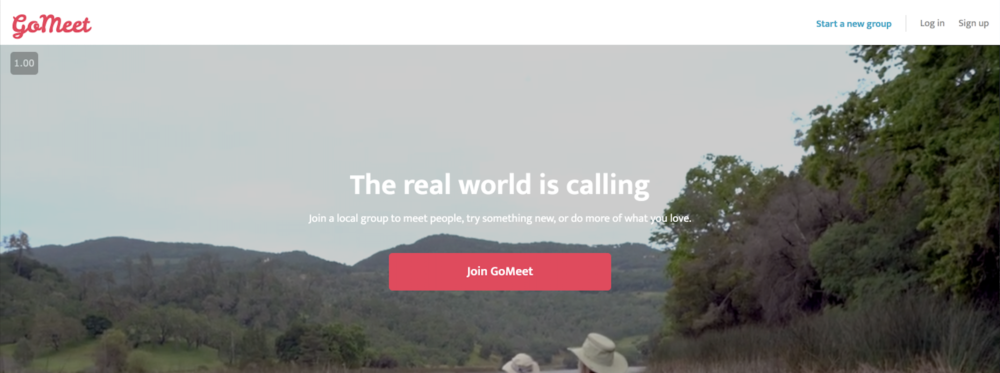
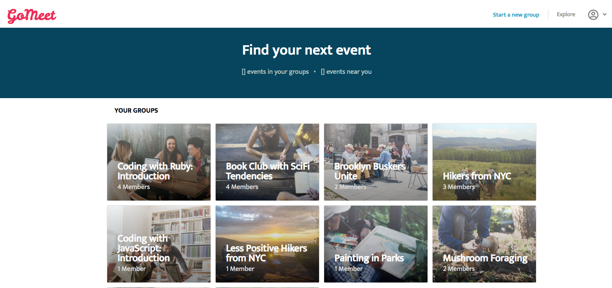
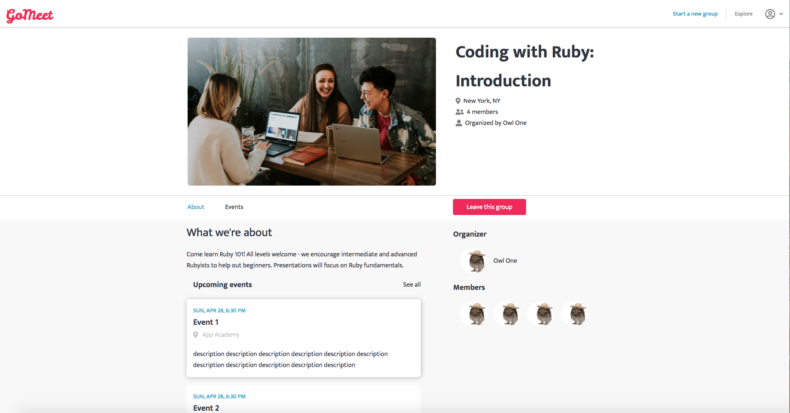

# GoMeet

GoMeet is a clone of Meetup, a service used to organize online groups that host in-person events for people with similar interests. Users can join groups in their area or create their own to connect with folks who share their interests.



## Features

Users can create groups, join groups, and add events in groups they created. Certain functionalities of the site are only available to authorized users. 



### Groups

Users can create groups and join/leave groups they are not creators of. There is an associated membership joins table on the backend that reflects folks joining and leaving groups while using the site. The main group page lists the group's members and associated events. 



Since users can only leave a group from the group's page and the functionality is built into a toggled button, we do not have access to the `id` of the membership we want to delete. I defined a single resource route for membership deletion: 

 ``` ruby
  resource :memberships, only: [ :destroy ]
 ```

Once in the controller, we find the necessary membership `id` by looking with the current user's memberships and searching by `:group_id` since a user can only delete their own memberships. We then re-render the current group's show page, reflecting that the user is no longer a member. 

``` ruby
  def destroy 
    membership = current_user.memberships.find_by(group_id: params[:group_id])
    @group = Group.find(params[:group_id])
    membership.delete
    render "api/groups/show", group: @group
  end 
```
### Events

Coming soon!
